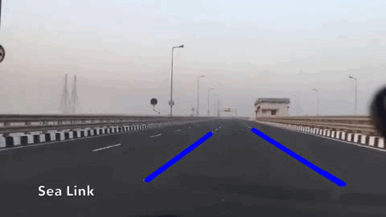
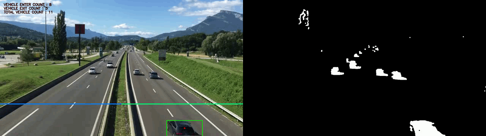

# video-analytics


* To download the videos used in the experiments, follow this [link](https://drive.google.com/drive/folders/1eOw443_Fb8ePM95IvQWMrlK3476x3fcq?usp=sharing).
* Demo output videos [Link](https://sagar16812.github.io/video-analytics/).


## Prerequisite:
1. Python3
2. Opencv >= 3.*

## Simply run the following command:
```
python main.py
```
## Lane detection using opencv and python output video:


## Count the number of vehicles that enter or exit using opencv and python
